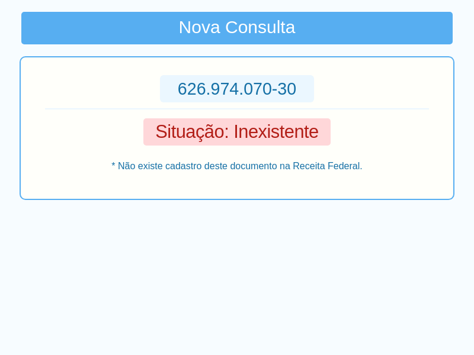
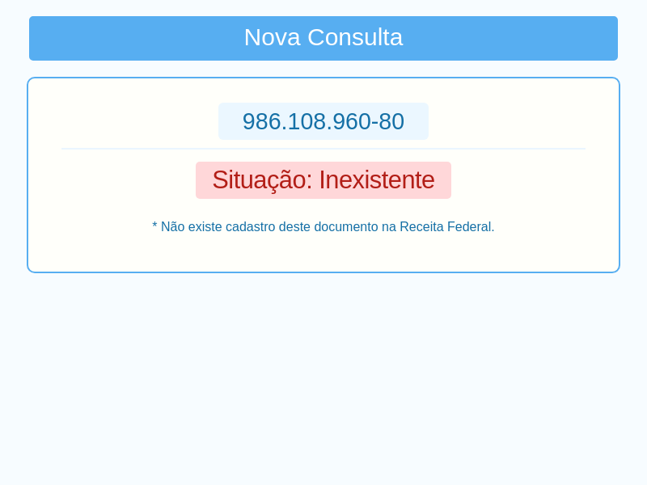

# :robot: Robô em NodeJS para automatização da consulta de cpf no site situação cadastral

:x::x::x:Importante!!!:x::x::x: Testado com cpfs de teste gerado pela API 4devs
## Tecnologias

 - NodeJS
 - puppeteer
 
 
## Run
 - git clone 
 - npm i
 - node index,js
 
 
 
 
